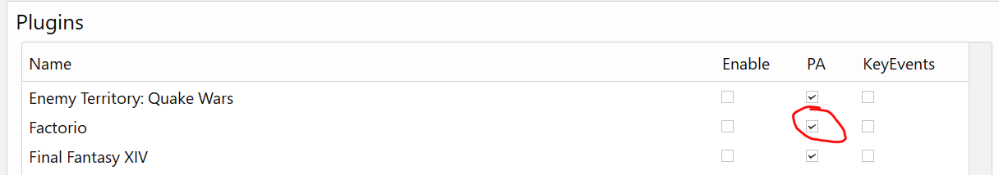
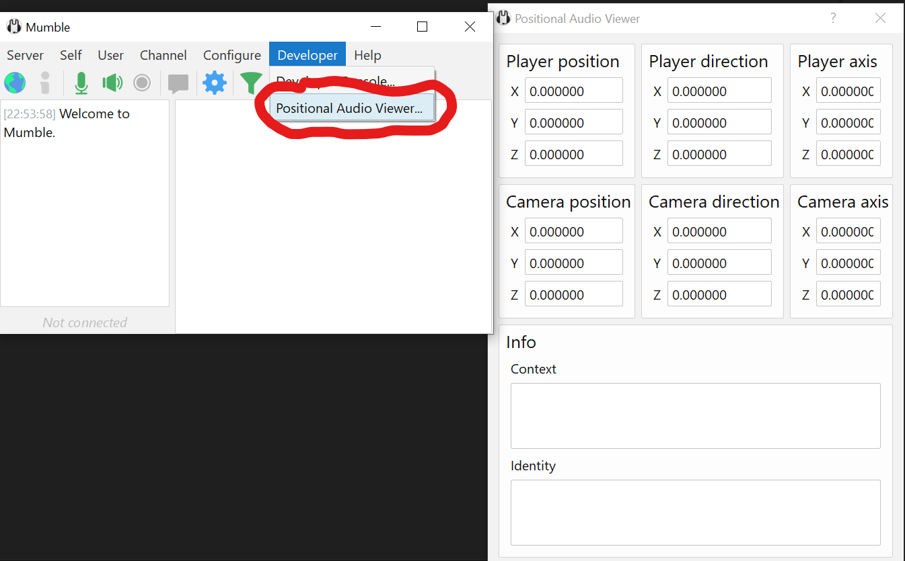

# Factorio Positional Audio Mumble Plugin

Factorio plugin for Mumble's Positional Audio API. Requires Factorio positional audio mod.

## Installation

1. Download the latest `factorio.mumble_plugin` from the [releases page](https://github.com/alifeee/MumblePlugin-FactorioPositionalAudio/releases).
2. Install the plugin in Mumble
  
3. Enable positional audio
  
4. Done! To check it works, try the positional audio viewer (requires Mumble v1.5)
  

## Development

The main plugin is in [plugin.c](./plugin.c). For development guide, see [plugin docs](https://github.com/mumble-voip/mumble/blob/master/docs/dev/plugins/README.md).

To build it, I use [GitHub actions](https://github.com/alifeee/MumblePlugin-FactorioPositionalAudio/actions). The plugin is generated as a file `factorio.mumble_plugin` in the `bundle` artifact (deleted after 1 day).

To make a release, I make a release then manually add `factorio.mumble_plugin` to the release. Version number must be changed in [plugin.c](./plugin.c), [CMakeLists.txt](./CMakeLists.txt), and [manifest.xml](./manifest.xml).
